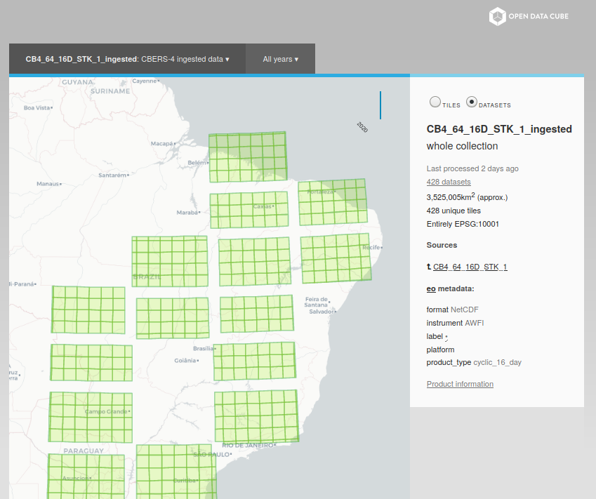

..
    This file is part of bdc-odc
    Copyright 2020 INPE.

    bdc-odc is free software; you can redistribute it and/or modify it
    under the terms of the MIT License; see LICENSE file for more details.

Usage
=======

The use of ``datacube-explorer`` is divided into two distinct parts. The first one refers to the ``cubedash-gen`` command-line tool that configures the database by defining the extensions of the cataloged ``ODC-Datasets``.

Generating the data extents
-----------------------------

The first step refers to the creation of the extents of the data cataloged in the ODC. In this process, the ``cubedash-gen`` tool is used, which, as mentioned, is responsible for configuring the database, calculating the extents, and going up the database

To start, we will generate the ``datacube-explorer`` schema inside PostgreSQL, and we will already calculate the extents. Through the use of ``cubedash-gen``, these options can be expressed by the command below::

    cubedash-gen --init --all --custom-crs-definition-file custom_crs.json

.. note::

    For the BDC, it is necessary to use the ``--custom-crs-definition-file`` option, which allows custom CRSs based on the ``custom_crs.json`` file. This gives the user the freedom to choose which projection to work on and avoids data reprojections within the ``datacube-explorer``.

.. note::

    If you have installed the tool using Docker, it is necessary to use the ``docker-compose exec explorer bash`` command to access the container termination and then perform the execution of the command presented previously

After the execution is finished, an output similar to the one presented below should be presented. In this output, all the cataloged products will be presented::

    Initialising schema
    Updating 6 products for LocalConfig<loaded_from=['/home/bdc/.datacube.conf'], environment='datacube', config={'db_database': 'opendatacube', 'db_hostname': '127.0.0.1', 'db_username': 'opendatacube', 'db_password': '***', 'db_port': '5432', 'index_driver': 'default', 'db_connection_timeout': '60'}>
    Generating product summaries...

    CB4_64_16D_STK_1 done: (15 datasets)
    CB4_64_16D_STK_1_ingested done: (428 datasets)
    done. 2/2 generated, 0 failures

Running the application
-------------------------

With all previous steps completed, it is now possible to run the ``datacube-explorer`` application and then start the searches and views data that are cataloged.

For those running directly in a conda environment, it is possible to run the data-explorer through the gunicorn tool::

    gunicorn -b '127.0.0.1:5000' -w 4 cubedash:app

On the other hand, if you are in the Docker, restart the container and ready, the access can already be::

    docker-compose restart

Now the application can be accessed through the address `127.0.0.1:5000/bdc/odc/ <127.0.0.1:5000/bdc/odc/>`_.

The result presented on the screen will be similar to the one presented below and may vary according to the products registered in your ODC instance

